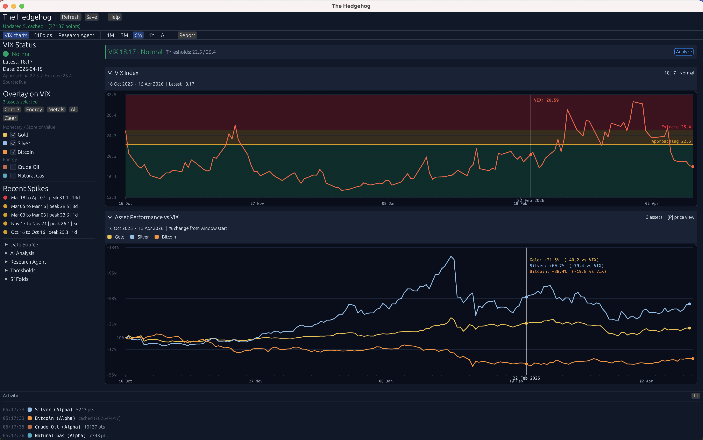
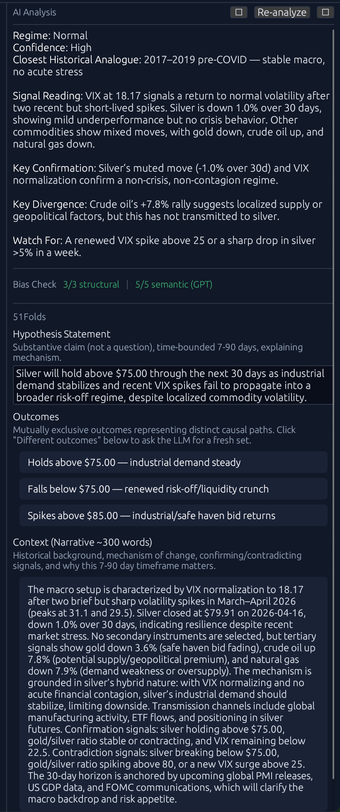
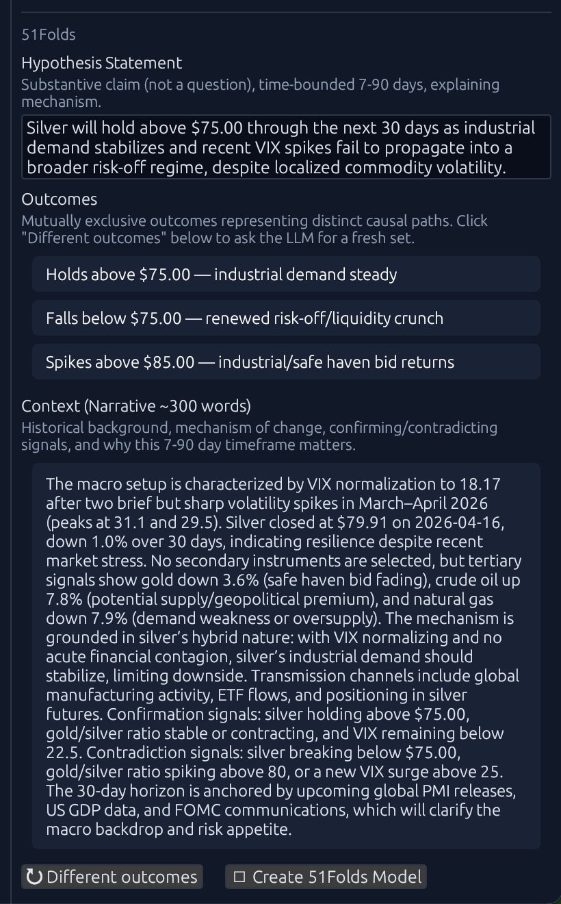
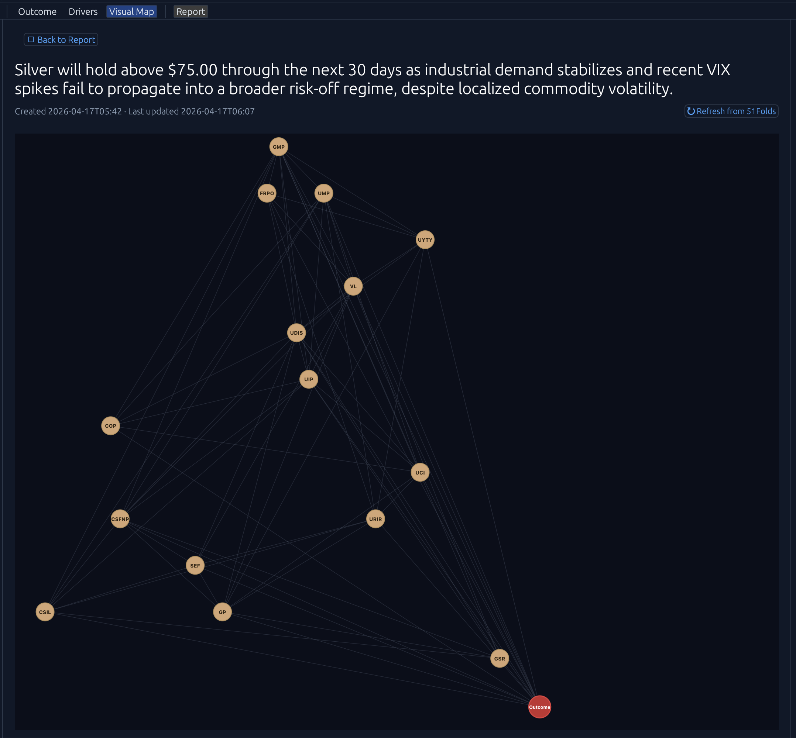
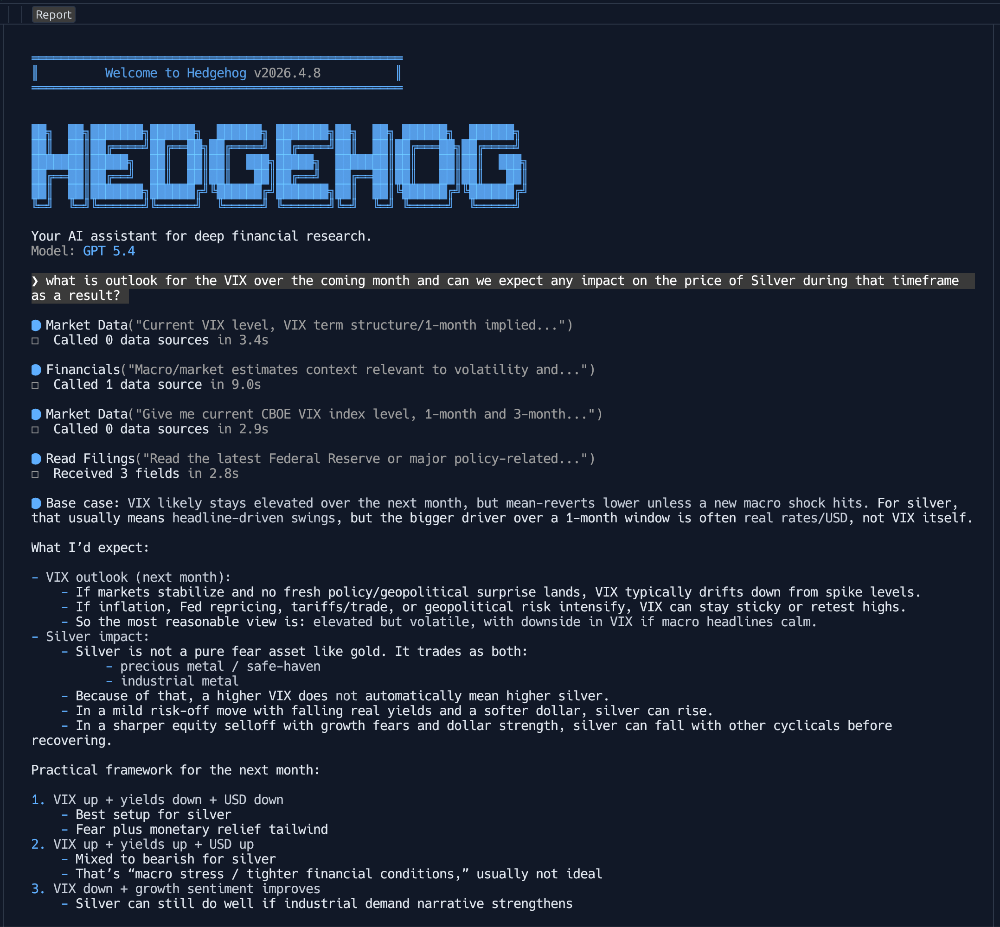
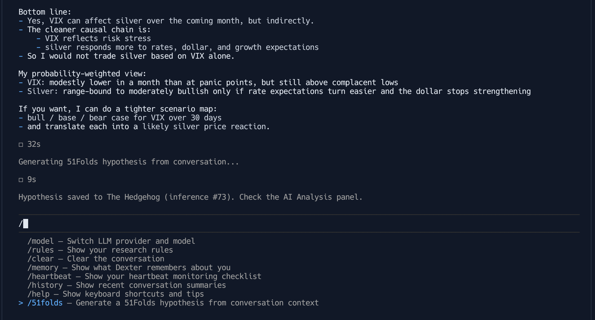
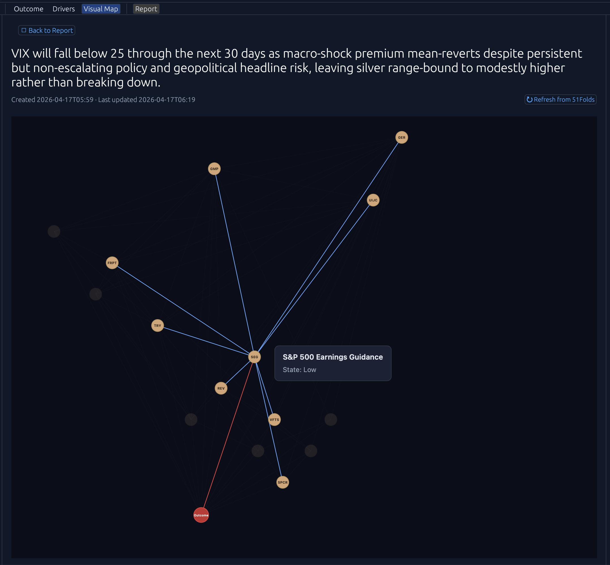

# The Hedgehog: what it is and how it got here

Recap: A few weeks ago I was listening to Anthony Pompliano's conversation with Jordi Visser. Jordi was talking about the regime shift he sees unfolding in the global economy, and in passing he made a remark about the VIX's relationship to silver: the idea that silver does something specific when volatility spikes, and that accumulating it into those spikes might be a position worth holding.

That remark stuck. Not as advice, but as a *question*. Is the relationship actually there in the data? What does it look like across gold, Bitcoin, crude oil, natural gas? Can I see it with my own eyes, every day, without refreshing six different tabs?

So I started building.

Oh, and before I forget, a quick aside about the name. There's a line from the ancient Greek poet Archilochus that Isaiah Berlin made famous in a 1953 essay: *"the fox knows many things, but the hedgehog knows one big thing."* Berlin used it to split great thinkers into two camps: the hedgehogs who see the world through a single organising idea and drive it relentlessly, and the foxes who range across many ideas without ever committing to one. Tolstoy, he argued, was by nature a fox who desperately wanted to be a hedgehog. The essay is really about that tension.

This app is unapologetically a hedgehog. It was built around one big thing: that regime shifts leave a signature in the VIX-and-commodities relationship, and that you can watch for it every day if you know where to look. Everything else in here is just a different instrument pointed at that same claim: the charts, the AI analysis, the 51Folds models, the research agent. Four tools, one question. Hedgehog-style.

The first cut was modest: a personal dashboard that pulls the VIX from FRED and the commodity closes from Alpha Vantage, overlays them on each other, and lets me scrub back through history. The history goes deeper than I expected: VIX data back to 1990, crude back to 1986, silver and gold from 2011, Bitcoin from its earliest tradable prints in 2010, natural gas from 1997. That's thirty-plus years of context for a question that started out as a single podcast remark.

The second move was to plug an LLM into all of it. Anthropic and OpenAI both have keys in the app, and the analysis layer gets the charted data, the overlays, the current readings, and a body of gathered research on the VIX-commodity relationships as context. You hit **Analyze**, and it produces a regime hypothesis: what kind of environment the market appears to be in, which instruments are behaving characteristically, which aren't. I added a bias-validation layer on top of that, because LLMs will happily anchor on whatever price was recently in front of them, and a second-model judge catches that drift before it ends up in the record.

<table cellspacing="0" cellpadding="0" border="0" style="border:none;border-collapse:collapse;"><tr>
<td style="border:none;"></td>
<td style="border:none;"></td>
</tr></table>

The third move is the one where the application stopped being just a personal tool.

I'm an angel investor and counsellor to **51Folds**, and 51Folds does something that I've wanted for years: it takes a hypothesis and builds a causal probabilistic neuro-symbolic model from it, a Bayesian network of drivers and outcomes, with the structure derived from the hypothesis itself. So I wired The Hedgehog directly into the 51Folds API. Every regime hypothesis the AI layer produces can be submitted to 51Folds with one click, and the app polls the build to completion (usually 45–75 minutes), then pulls back the full driver graph, the outcome probabilities, and the justification for each. You can flip driver states and re-evaluate to see how the probabilities shift (what-if analysis against the regime thesis).

The driver graph gets rendered as an interactive D3.js DAG inside the app. Click a node, see its state and justification. Hover, see the causal relationships light up.

### Integrating Dexter into The Hedgehog

The fourth move brought in **[Dexter](https://github.com/virattt/dexter)**. Dexter is an open-source autonomous agent for deep financial research. It takes complex financial questions, decomposes them into structured research plans, executes them against live market data, and self-validates its own work before returning a data-backed answer. It's a conversational agent you talk to, not a dashboard you watch.

 

Rather than run it as a separate tool, I vendored it into The Hedgehog and made it a first-class tab: the Research Agent. You can have a freeform conversation with an LLM about any market, any thesis, any timeframe, and when you've built up something worth testing, I added a custom `/51folds` slash command that synthesises the research into a structured hypothesis and feeds it straight into the model-creation pipeline. Dexter-inside-Hedgehog is no longer called Dexter; the terminal theme and voice are now the Hedgehog's own.

That's where it sits now. One application with four thin layers that compose cleanly:

- A live dashboard of the VIX and five commodity/asset instruments, with overlay and zoom.
- An AI analysis layer that produces regime hypotheses from the visible data, with bias-validation.
- A Bayesian modelling layer (via 51Folds) that turns those hypotheses into probabilistic driver graphs with interactive re-evaluation.
- A conversational research agent that can originate its own hypotheses and push them through the same pipeline.

Everything persists. Every inference, every model, every report is stored locally so you can come back to a hypothesis from last month, reload it, rerun a failed build, regenerate a summary report across a date range.

*[Screenshot: Summary Report view with a month's worth of inferences loaded]*

It started as a way to look at Jordi's silver-and-VIX observation more carefully. It ended up as a workbench for building and testing regime theses against the hardest kind of scrutiny I know how to apply to them.

*[Screenshot: app banner / splash, for the close]*

### If you want to run it yourself

The source lives on GitHub at **[cyclomaticsegal/TheHedgehog](https://github.com/cyclomaticsegal/TheHedgehog)**. Fork it, clone it, build it. For the full four-layer stack to work end-to-end you'll need a few keys:

- **A [51Folds](https://51folds.ai) account**: signup comes with free credits, enough to build several models before you need to pay for more. Without it the Hedgehog still works as a dashboard with AI analysis; you just can't push hypotheses into causal model creation.
- **An [Alpha Vantage](https://www.alphavantage.co) API key**: every commodity in the app (gold, silver, Bitcoin, crude oil, natural gas) pulls daily closes from Alpha Vantage. Free tier is fine; the app caches each day so the quota only burns once per trading day.
- **A [FRED](https://fred.stlouisfed.org) API key** for the VIX series (also free).
- **An Anthropic or OpenAI key** for the AI Analysis and Research Agent layers, whichever you already have.

Drop them into a local `.env` and you're running.
